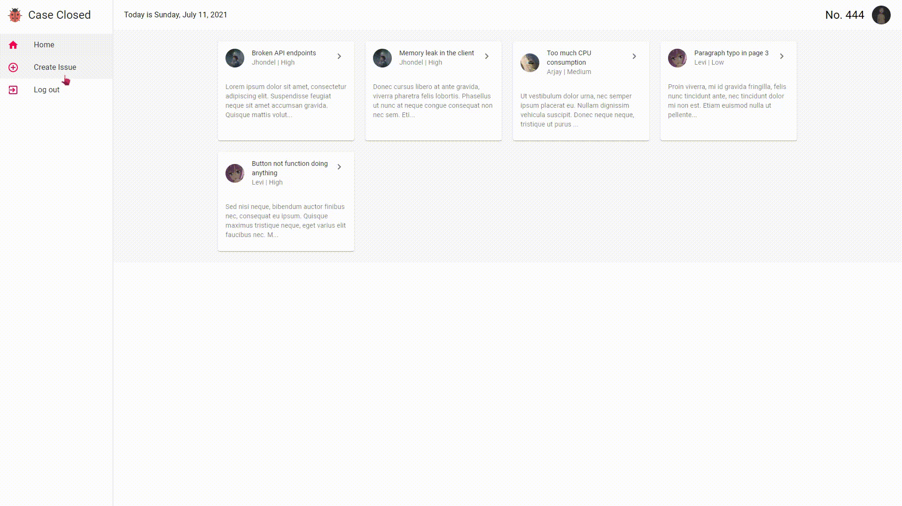

## Case Closed - An issue tracker React application

### Notes
* The frontend is hosted on Netlify for free.
* The backend is hosted on Heroku, also for free which may cause slow initial load times.

### Built with: 
* ### Frontend
    * JavaScript
    * React
    * React Router
    * Auth0
    * Axios
    * Material UI
    * HTML
    * CSS
* ### Backend
    * JavaScript
    * Node.js
    * Express
    * MongoDB

### Demo:
